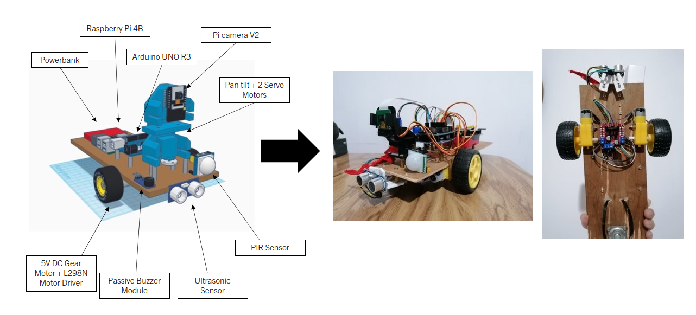

# AlarmBuzz

AlarmBuzz is an autonomous burglar detection robot that detects human presence using a camera and sends notifications to Discord when humans are detected. It combines Python and Arduino code to create a system that can be used for security or surveillance purposes.



## Requirements

To run the AlarmBuzz program, you need to have the following dependencies installed:

- Python 3
- TensorFlow
- Keras
- PySerial
- OpenCV-Python
- imutils
- dhooks
- Arduino IDE (for uploading the Arduino sketch)

## Installation

1. Clone the repository or download the source code files.

2. Install the required Python packages by running the following command in your terminal or command prompt:

   ```shell
   pip install -r requirements.txt
   ```

3. Upload the main.ino Arduino sketch to your Arduino board using the Arduino IDE.

## Usage

1. Connect the camera to your computer.

2. Connect the Arduino board to your computer and make sure the appropriate drivers are installed.

3. Modify the `main.py` file if necessary, such as changing the serial port (`ser = serial.Serial('/dev/ttyUSB0', 9600, timeout=1)`) to match your system.

4. Run the `main.py` script using Python:

   ```shell
   python main.py
   ```

5. The program will display a welcome message and prompt you to enter your name.

6. Enter the desired duration for the alarm buzz in seconds.

7. The program will open a serial connection with the Arduino board, send a "start" command, and begin monitoring for human presence.

8. When humans are detected, the program will capture an image and send a notification to a specified Discord webhook.

9. To stop the program and end the alarm buzz, press Ctrl+C.

## Configuration

1. `main.py`: Modify the serial port (`ser = serial.Serial('/dev/ttyUSB0', 9600, timeout=1)`) to match your system's serial port configuration. You can also customize the welcome message and alarm duration prompt.

2. `main.ino`: Configure the pin connections and motor settings based on your hardware setup. Adjust the speed of the motors (const int motorSpeed = 255) if needed.

3. `hogDescriptor.py`: Adjust the HOG parameters if necessary to improve human detection accuracy. You can modify the detection threshold and region of interest (ROI) size.

## Contributing

Contributions to the AlarmBuzz project are welcome! If you find any issues or have suggestions for improvements, please open an issue or submit a pull request on GitHub.
